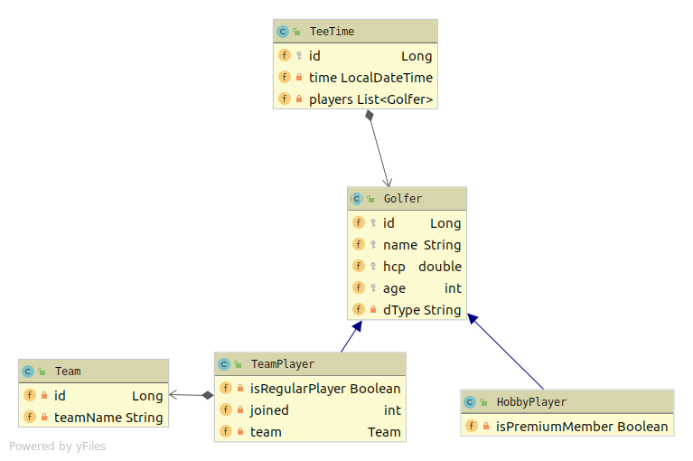

# Golfplatz-Administration
Das Projekt dient zur Administration eines Golfplatzes. Golfer sind entweder Mitglied der Mannschaft(Teamplayer) oder nur Hobbyspieler. Alle können Startzeiten (TeeTimes) für den 18-Loch Kurs buchen. 

### CLD

### 

### Starten der DB & Prometheus Server

Ein `docker-compose.yml`steht zur Verfügung um die PostgreSQL auf Port `5432` und den Prometheus Server auf Port `8282` zu starten


### Starten der Projekte

Zum Starten der Projekte habe ich den Dev-Mode `./mvnw compile quarkus:dev` ohne Docker verwendet, da ich mit dem Bauen der Images im `docker-compose.yml` Probleme bekommen habe. 

```
gca:
   build:
     context: ./gca/src/main/docker
     dockerfile: Dockerfile.jvm
   depends_on:
     - postgres
   ports:
     - 8080:8080
```

Fehler beim Bauen der Images (der Fehler kommt nicht beim manuellen Bauen sondern nur im docker-compose):

`Service 'gca' failed to build: COPY failed: no source files were specified` 


### Prometheus

Prometheus ist ein Server, der Metrics grafisch aufbereitet darstellt. Konfiguriert wird er über ein `prometheus.yml` File. Durch die `quarkus-smallrye-metrics` Dependency bekommt man Metrics automatisch in /metrics/application mitgeliefert. Diese werden von Prometheus abgefragt und angezeigt (Diagramme usw.).


### Istio

Istio ist ein Tool, das das Zusammenspiel mehrerer Microservices erleichtert, indem gesteuert wird wer mit wem kommunizieren kann. Zusätzlich bietet es Load-Balancer und Metrics.


### Unit - Tests

Im `microservice` Projekt existieren Unit-Tests die die Korrektheit der Abfragen und Aggregationen überprüfen.

### Extensions hinzufügen

```
mvn quarkus:add-extension -Dextensions="health"
mvn quarkus:add-extension -Dextensions="metrics"
```
#### Ergebnis in pom.xml:
```
<dependency>
    <groupId>io.quarkus</groupId>
    <artifactId>quarkus-smallrye-metrics</artifactId>
</dependency>
<dependency>
    <groupId>io.quarkus</groupId>
    <artifactId>quarkus-smallrye-health</artifactId>
</dependency>
```

### Ports konfigurieren:
```
quarkus.http.port=8080
%dev.quarkus.http.port=8181
```

### Metrics:
 - @Counted
 - @Timed
 - @Gauge

```
curl -H"Acept: application/json" localhost:8181/metrics/application
```

### Health:
```
curl -H"Acept: application/json" http://localhost:8181/health
```